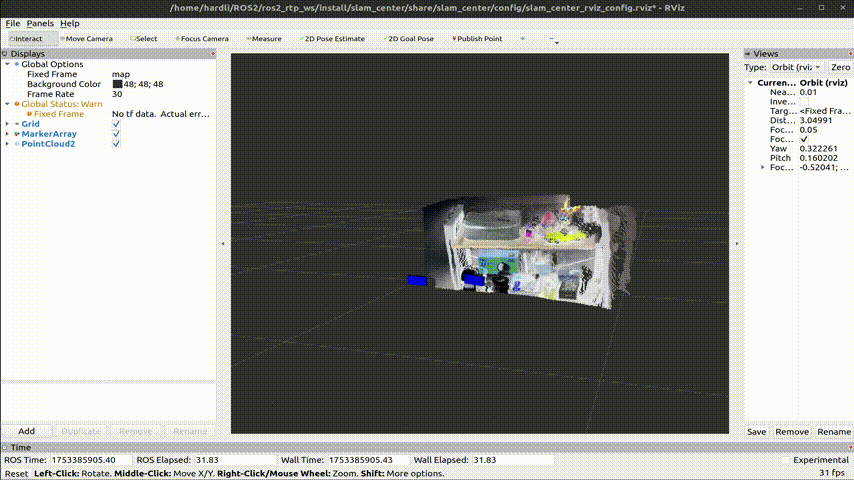

# MASt3R-SLAM: message exchange with ZMQ socket

This repository is forked and adjusted from original [MASt3R-SLAM](https://github.com/rmurai0610/MASt3R-SLAM.git). This version gets live-stream images from ZMQ socket as input, and publishes outputs (i.e. 3D point cloud and camera poses) also into ZMQ sockets.

This is part of project [ros_multidevices_rtmslam](https://github.com/MyLovelyAxe/ros_multidevices_rtmslam). Here is a demo to visualize with Rviz:



# Getting Started

## Installation

```bash
conda create -n mast3r-slam python=3.11
conda activate mast3r-slam
```

This project is tested with CUDA11.8, install pytorch with **matching** CUDA version:

```bash
pip install torch==2.5.1 torchvision==0.20.1 torchaudio==2.5.1 --index-url https://download.pytorch.org/whl/cu118
```

In order to exchange messages with ZMQ socket, install `pyzmq`:

```bash
pip install pyzmq==26.4.0
```

Clone the repo and install the dependencies.

```bash
git clone --branch ros https://github.com/rmurai0610/MASt3R-SLAM.git --recursive
cd MASt3R-SLAM/

# if you've clone the repo without --recursive run
# git submodule update --init --recursive

pip install -e thirdparty/mast3r
pip install -e thirdparty/in3d
pip install --no-build-isolation -e .
```

Setup the checkpoints for MASt3R and retrieval.  The license for the checkpoints and more information on the datasets used is written [here](https://github.com/naver/mast3r/blob/mast3r_sfm/CHECKPOINTS_NOTICE).

```bash
mkdir -p checkpoints/
wget https://download.europe.naverlabs.com/ComputerVision/MASt3R/MASt3R_ViTLarge_BaseDecoder_512_catmlpdpt_metric.pth -P checkpoints/
wget https://download.europe.naverlabs.com/ComputerVision/MASt3R/MASt3R_ViTLarge_BaseDecoder_512_catmlpdpt_metric_retrieval_trainingfree.pth -P checkpoints/
wget https://download.europe.naverlabs.com/ComputerVision/MASt3R/MASt3R_ViTLarge_BaseDecoder_512_catmlpdpt_metric_retrieval_codebook.pkl -P checkpoints/
```

## Example images

You can still test the model with images stored locally. Download some examples:

```bash
bash ./scripts/download_tum.sh
```

Run the model reading local images:

```bash
bash ./scripts/download_tum.sh
python main.py --dataset datasets/tum/rgbd_dataset_freiburg1_room/ --config config/calib.yaml
```

# Original Citation
If you found this code/work to be useful in your own research, please considering citing the following:

```bibtex
@article{murai2024_mast3rslam,
    title={{MASt3R-SLAM}: Real-Time Dense {SLAM} with {3D} Reconstruction Priors},
    author={Murai, Riku and Dexheimer, Eric and Davison, Andrew J.},
    journal={arXiv preprint},
    year={2024},
}      
```
